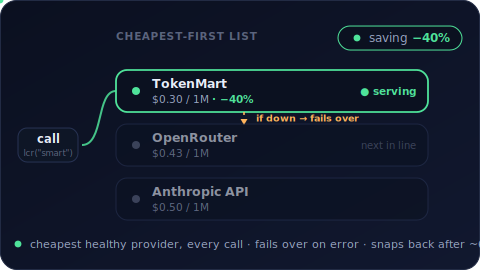

# AI-LCR — AI 最低成本路由（Least Cost Routing）

<p align="center">
  <a href="./README.md">English</a> · <b>简体中文</b>
</p>

<p align="center">
  <b>LLM 调用的自动最低成本路由。一行代码，降低 AI 账单。</b>
</p>

<p align="center">
  <a href="https://www.npmjs.com/package/ai-lcr"></a>
  
  <a href="https://ai-sdk.dev"></a>
</p>

<p align="center">
  
</p>

同一个模型在不同 provider 上的价格不同——而且没有任何单一 provider 在所有模型上都最便宜。`ai-lcr` 为每个模型维护一份「最便宜优先」的列表，路由到其中最便宜且健康的 provider（下表中的 ⭐），失败时向下穿透——这正是电话运营商几十年来一直在做的 [最低成本路由（Least Cost Routing）](https://en.wikipedia.org/wiki/Least-cost_routing)。

## 安装

```bash
npm install ai-lcr
```

`ai`（Vercel AI SDK）是 peer dependency。

## 快速开始

```ts
import { createLCR } from "ai-lcr";
import { createOpenAICompatible } from "@ai-sdk/openai-compatible";
import { generateText } from "ai";

const kunavo = createOpenAICompatible({
  name: "kunavo",
  baseURL: "https://api.kunavo.com/v1",
  apiKey: process.env.KUNAVO_API_KEY,
});
const openrouter = createOpenAICompatible({
  name: "openrouter",
  baseURL: "https://openrouter.ai/api/v1",
  apiKey: process.env.OPENROUTER_API_KEY,
});

const lcr = createLCR({
  autoSort: true, // 按 `cost` 把每个模型的 provider 排成最便宜优先
  models: {
    // 一个逻辑模型，跨多个 provider 最便宜优先地提供服务。
    "gemini-3-flash": [
      { model: kunavo("gemini-3-flash"), label: "kunavo", cost: { input: 0.40, output: 2.40 } },
      { model: openrouter("google/gemini-3-flash-preview"), label: "openrouter", cost: { input: 0.5, output: 3.0 } },
    ],
  },
  // 看清每次调用的实际花费，以及由哪个 provider 提供。
  onCost: ({ provider, costUsd }) => console.log(`${provider}: $${costUsd.toFixed(6)}`),
});

const { text } = await generateText({
  model: lcr("gemini-3-flash"),
  prompt: "Explain Least Cost Routing in one sentence.",
});
```

`cost` 和 `label` 都是可选的——如果你不需要成本核算或 `autoSort`，可以直接传裸模型（`kunavo("gemini-3-flash")`）。`lcr("gemini-3-flash")` 返回一个标准的 AI SDK 模型，因此可与 `generateText`、`streamText`、`generateObject`、工具调用和 agent 一起使用。

## 直连模型厂商官方 API（原生 provider）

「provider」不一定是聚合器。模型厂商**自己的官方 API** 就是列表里的又一个 entry——往往是最便宜的那个（没有聚合器加价），也最不容易悄悄破坏原生特性（prompt 缓存、工具调用）。任何 AI SDK 的 provider 包都返回标准模型，所以厂商的原生 API 和 OpenAI 兼容的聚合器可以并排放在同一个列表里：

```ts
import { createLCR } from "ai-lcr";
import { createDeepSeek } from "@ai-sdk/deepseek";          // DeepSeek 官方 API
import { createOpenAICompatible } from "@ai-sdk/openai-compatible";

const deepseek = createDeepSeek({ apiKey: process.env.DEEPSEEK_API_KEY });
const openrouter = createOpenAICompatible({
  name: "openrouter",
  baseURL: "https://openrouter.ai/api/v1",
  apiKey: process.env.OPENROUTER_API_KEY,
});

const lcr = createLCR({
  autoSort: true,
  models: {
    "deepseek-v4": [
      // 官方 API 优先——无加价，原生特性齐全（缓存、错峰折扣）。
      { model: deepseek("deepseek-chat"), label: "deepseek", cost: { input: 0.43, output: 0.87 } },
      // 聚合器作为兜底，保可用性 + 广覆盖。
      { model: openrouter("deepseek/deepseek-v4"), label: "openrouter", cost: { input: 0.43, output: 0.87 } },
    ],
  },
});
```

同样的模式适用于任何厂商的原生 SDK provider——`@ai-sdk/anthropic`、`@ai-sdk/google`、`@ai-sdk/openai`、`@ai-sdk/xai` 等等。它们都返回 `LanguageModelV3`，所以你可以在一个模型的列表里把厂商原生 API 和聚合器混着用。原生 API 覆盖窄（只有该厂商自己的模型）但特性全；聚合器覆盖广。**官方优先 + 聚合器兜底** 正是 LCR 最自然的形态。

## 开源权重模型的最便宜路由（DeepInfra）

对开源权重模型——DeepSeek、Kimi、MiniMax、GLM、Qwen——专门的推理托管商通常是最便宜的路由，明显低于聚合器价格。[DeepInfra](https://deepinfra.com) 兼容 OpenAI，直接当成列表里的又一个 entry 即可。**有一个坑**：它的 OpenAI endpoint 在 `/v1/openai`（`/v1/` 在 `openai` **前面**），不是常规的 `/v1`：

```ts
import { createLCR } from "ai-lcr";
import { createOpenAICompatible } from "@ai-sdk/openai-compatible";

const deepinfra = createOpenAICompatible({
  name: "deepinfra",
  baseURL: "https://api.deepinfra.com/v1/openai", // 注意：/v1/openai，不是 /v1
  apiKey: process.env.DEEPINFRA_API_KEY,
});
const openrouter = createOpenAICompatible({
  name: "openrouter",
  baseURL: "https://openrouter.ai/api/v1",
  apiKey: process.env.OPENROUTER_API_KEY,
});

const lcr = createLCR({
  autoSort: true,
  models: {
    // DeepInfra 最便宜；OpenRouter 作广覆盖 / 可用性兜底。
    // DeepInfra 用 HuggingFace 风格的 id（org/Name）。
    "deepseek-v4-flash": [
      { model: deepinfra("deepseek-ai/DeepSeek-V4-Flash"), label: "deepinfra", cost: { input: 0.10, output: 0.20 } },
      { model: openrouter("deepseek/deepseek-v4-flash"), label: "openrouter", cost: { input: 0.27, output: 1.10 } },
    ],
    "minimax-m2.5": [
      { model: deepinfra("MiniMaxAI/MiniMax-M2.5"), label: "deepinfra", cost: { input: 0.15, output: 1.15 } },
    ],
    "kimi-k2.5": [
      { model: deepinfra("moonshotai/Kimi-K2.5"), label: "deepinfra", cost: { input: 0.45, output: 2.25 } },
    ],
  },
});
```

DeepInfra 只承载开源权重——没有第一方 Claude / GPT / Gemini。那些闭源模型请走 OpenRouter 或折扣中转。

## 它如何路由

1. **最便宜优先。** provider 按顺序依次尝试——把它们排成最便宜优先，或设置 `autoSort: true` 让它按 `cost` 自动排序。
2. **失败时向下穿透。** 遇到可重试的错误（限流、5xx、超时）时，前进到下一个 provider，且对流式安全。硬错误（400、401、403、422）会直接透传，不做重试。
3. **恢复。** 在一段空闲窗口（`resetIntervalMs`，默认 60s）之后，自动回到最便宜的 provider。

## 支持的 provider

任何 OpenAI 兼容的 endpoint 都可用——任何 AI SDK 的 provider 包也都可用，包括模型厂商自己的官方 API。

- **模型厂商官方 API（原生）：** 通过各自的 AI SDK provider 包直连 [DeepSeek](https://platform.deepseek.com)、[OpenAI](https://openai.com)、[Anthropic](https://anthropic.com)、[Google](https://ai.google.dev)、[xAI](https://x.ai) 等——无加价，原生特性齐全。见上方「直连模型厂商官方 API（原生 provider）」一节。
- **文本聚合器：** [OpenRouter](https://openrouter.ai)（覆盖最广，列表定价）· [Kunavo](https://kunavo.com/?ref=victorimf)（**全模型 8 折**）· [TokenMart](https://thetokenmart.ai)（按模型 85 折–35 折不等）
- **图像 / 视频：** [Kunavo](https://kunavo.com/?ref=victorimf)（**8 折**）· [TokenMart](https://thetokenmart.ai) · [fal.ai](https://fal.ai) · [Runware](https://runware.ai) —— 通过 `createMediaLCR` 路由。图像：Kunavo + Runware + fal。视频：fal（已可用，走其异步队列 API）；Kunavo 的 Veo 轮询路径已实现但未验证

## 文本模型价格

单位为每 100 万 token 的美元价格，input / output。官方价格截至 2026-05——请向各 provider 核对当前价格。OpenRouter 直接透传列表价；Kunavo 在官方价基础上统一 8 折。TokenMart 折扣按模型不同（85 折–35 折），请在 [thetokenmart.ai](https://thetokenmart.ai) 核对当前价格。

| 模型 | 官方价（in / out） | OpenRouter | [Kunavo](https://kunavo.com/?ref=victorimf) | [TokenMart](https://thetokenmart.ai) | 最便宜 |
|---|---|---|---|---|---|
| Gemini 3 Flash | $0.50 / $3.00 | 无折扣 | −20% | — | ⭐ Kunavo |
| Gemini 3 Pro / 3.1 Pro | $2.00 / $12.00 | 无折扣 | −20% | −20% → **$2.40 / $9.60** | ⭐ Kunavo |
| Gemini 2.5 Pro | $1.25 / $10.00 | 无折扣 | −20% | — | ⭐ Kunavo |
| Gemini 2.5 Flash | $0.30 / $2.50 | 无折扣 | −20% | — | ⭐ Kunavo |
| Claude Opus 4.7 | $15.00 / $75.00 | 无折扣 | −20% | **$4.25 / $21.25** | ⭐ TokenMart |
| Claude Sonnet 4.6 | $3.00 / $15.00 | 无折扣 | −20% | −15% → **$2.55 / $12.75** | ⭐ Kunavo |
| Claude Haiku 4.5 | $1.00 / $5.00 | 无折扣 | −20% | — | ⭐ Kunavo |
| DeepSeek V4 | $0.43 / $0.87 | 无折扣 | 未提供 | — | ⭐ DeepSeek（官方） |

Kunavo 提供 Anthropic + Google。DeepSeek / OpenAI / Grok / Mistral 路由到各自的**官方 API**（最便宜，原生特性齐全），以 OpenRouter 作为广覆盖兜底——一份配置即可混用原生厂商与聚合器。

> **注：** list 价 ≠ 有效价——请始终用 [probe](#给-provider-做体检能力--成本探测) 验证。截至 2026-05-28，Kunavo 在 Gemini（~1.1–1.4×）和 Claude（~1.0×）两条路上的 token 计数均已干净。现存问题：两个模型均忽略 `max_tokens`，Claude 隐藏 prompt 注入仍为间歇性——生产路由前请重新 probe。

> **注：** TokenMart token 计数同样经 probe 验证干净（后端与 Inference.ai 相同，2026-05-27 全项通过：工具调用、`max_tokens`、无注入、token ~1.0×、prompt 缓存）——如需 Claude 的第二 provider，TokenMart 是可靠备选。生产路由前请重新 probe 确认。

## 图像模型价格

单位为每张图的美元价格，截至 2026-05（provider 列表价 / 零售价；请核对当前价格）。Kunavo 为官方价 8 折。fal 与 Runware 是算力 provider——`ai-lcr` 为每个模型挑选最便宜的那个（⭐）。

| 模型 | fal.ai | Runware | [Kunavo](https://kunavo.com/?ref=victorimf) | [TokenMart](https://thetokenmart.ai) | 最便宜 |
|---|---|---|---|---|---|
| Nano Banana 2 | $0.080 | $0.069 | $0.054 | **$0.050** | ⭐ TokenMart |
| Nano Banana Pro | $0.080 | — | $0.107 | — | ⭐ fal |
| GPT-Image-2 | $0.210 | $0.094 | $0.102 | — | ⭐ Runware |
| Imagen 4 Ultra | $0.060 | $0.060 | — | — | ⭐ fal / Runware |
| Ideogram V3 | $0.060 | $0.060 | — | — | ⭐ fal / Runware |
| Seedream 4 | $0.030 | — | — | — | ⭐ fal |
| Flux 1.1 Pro | $0.040 | $0.040 | — | — | ⭐ fal / Runware |
| Flux Dev | $0.025 | $0.025 | — | — | ⭐ fal / Runware |
| Flux Schnell | $0.0030 | $0.0013 | — | — | ⭐ Runware |
| Qwen-Image | — | $0.0038 | — | — | ⭐ Runware |
| FLUX.2 Klein 4B | — | $0.0006 | — | — | ⭐ Runware |

## 视频模型价格

单位为每秒的美元价格，截至 2026-05——请核对当前价格。视频计费方式因 provider 而异，因此无法做严格对等的跨 provider 表格：fal.ai 和 Runware 按秒计费，而 Kunavo 的 Veo 按段计费（Fast ~$0.28 / Lite ~$0.168 / Quality ~$1.34）。下表为 fal.ai 的每秒价格（测试中的视频主力）；fal / Runware / Kunavo 的归一化对比是一个 TODO。

| 模型 | fal.ai（$/s） |
|---|---|
| Seedance Lite | $0.036 |
| Hailuo 02 Standard | $0.045 |
| LTX-2 | $0.060 |
| Kling 2.6 Pro | $0.070 |
| WAN 2.2 | $0.080 |
| Veo 3.1 Lite | $0.080 |
| Kling V3 Pro | $0.112 |
| Seedance Pro | $0.124 |
| Veo 3.1（audio-on） | $0.400 |

## 给 provider 做体检（能力 + 成本探测）

折扣再大，如果 provider 偷偷破坏了协议就一文不值。`ai-lcr` 自带一个零依赖的检查脚本（`scripts/check-provider.sh`，只需 `bash` + `curl` + `python3`），**逐模型**核查那些真正会让你多花钱或污染输出的点：

- **工具调用** —— 单次调用 + 带 `content: null` 的多步 round-trip（每个 agent 循环都会发的形态）
- **`max_tokens` 是否生效** —— cap 必须能限制输出长度
- **隐藏 prompt 注入** —— 发一条中性消息，如果模型开始回应一段它从没收到过的 system prompt，就说明 provider 注入了东西
- **token 超计** —— 把上报的 `prompt_tokens` 和一个可信基线 provider 对照，>1.5× 说明账单被灌水、"折扣"可能是亏本
- **prompt 缓存** —— `cache_control` 在重复请求时是否真的产生 `cache_read`

```bash
# 指向你要体检的 provider；模型用通用编号槽位（Gemini / Claude / GPT / Llama 都行）。
# 给某个模型配上 REF_n（可信基线上的对应模型 id）即可启用 token 超计检查。
# CACHE_MODEL（可选）跑 Anthropic 原生 /v1/messages 的 prompt 缓存测试。
API_KEY=$KUNAVO_API_KEY BASE=https://api.kunavo.com \
  MODEL_1=gemini-3-flash    REF_1=google/gemini-3-flash-preview \
  MODEL_2=claude-sonnet-4-6 REF_2=anthropic/claude-sonnet-4.6 \
  CACHE_MODEL=claude-sonnet-4-6 \
  REF_API_KEY=$OPENROUTER_API_KEY REF_BASE=https://openrouter.ai/api \
  bash scripts/check-provider.sh

# TokenMart（Inference AI）使用不带 vendor 前缀的裸模型 ID
API_KEY=$INFERENCE_API_KEY BASE=https://model.service-inference.ai \
  MODEL_1=gemini-3-flash-preview      REF_1=google/gemini-3-flash-preview \
  MODEL_2=claude-sonnet-4-6           REF_2=anthropic/claude-sonnet-4.6 \
  CACHE_MODEL=claude-sonnet-4-6 \
  REF_API_KEY=$OPENROUTER_API_KEY REF_BASE=https://openrouter.ai/api \
  bash scripts/check-provider.sh
```

注入或 token 超计这两项 `FAIL`，意味着该 provider 对那个模型来说**不是**安全的最低成本目标——在它修好之前，别把它放进那个模型的「最便宜优先」列表，修好后重新探测。

### 信任矩阵（探测于 2026-05-27）

两个 OpenAI 兼容 provider，同一脚本，同一天。单元格覆盖两个家族（G = Gemini，C = Claude）。

| 检查项 | Kunavo | [TokenMart](https://thetokenmart.ai) |
|---|---|---|
| 工具调用（单次 + 多步 `content: null`） | G ⚠️ 间歇性¹ · C ✅ | ✅ 两者 |
| token 计数 vs OpenRouter 基线 | G ✅ ~1.1–1.4× · C ✅ ~1.0× | ✅ 两者 ~1.0× |
| 隐藏 prompt 注入 | G ✅ 无 · C ❌ 间歇性² | ✅ 无 |
| `max_tokens` 是否生效 | ❌ 被忽略（两者） | ✅ 两者 |
| prompt 缓存（`cache_control`） | C ❌ 未生效（探测中途 endpoint 还卡死） | C ✅ `cache_read` > 0 |

¹ Kunavo Gemini 一次返回干净的工具调用，下一次相同请求却**完全丢掉了 tools**——不是稳定通过。
² Kunavo Claude 一次对着幻觉中的"fake system prompt"作出反应，另一次又干净——注入是间歇性的，不是被移除了。

**结论：** TokenMart 在 Gemini 和 Claude 两条路上每一项都通过，且结果稳定可复现——可以放心路由。Kunavo：Claude token 计数已干净（2026-05-28 重新 probe），按 8 折 list 价，Kunavo 现在是 Claude 模型的最便宜选择。现存问题：两个模型均忽略 `max_tokens`、Claude 隐藏 prompt 注入仍为间歇性、Gemini 也会间歇性丢工具调用——用新模型前先重新探测。

## 路线图

- [x] 自有 failover 引擎——最便宜优先路由 + 流式安全的 fallback，不依赖外部路由库
- [x] 真实的逐次调用成本核算（`onCost`）
- [x] 基于各 provider `cost` 的自动最便宜优先排序（`autoSort`）
- [x] 离线能力 + 成本检查（`scripts/check-provider.sh`）→ 逐模型信任矩阵
- [ ] 内置价格表，实现零配置定价（省去手填 `cost` 数字）
- [ ] provider 怪癖中间件（透明地修补已知怪癖，如 Kunavo 被忽略的 `max_tokens`）
- [ ] 把 probe 结果自动接入路由（探测失败的 provider×model 自动从列表剔除）
- [x] 图像与视频模型路由（`createMediaLCR`）—— 图像走 Kunavo + Runware + fal；**视频已可用，走 fal**（异步队列 API）
- [ ] 归一化的跨 provider 视频价格对比 + 验证 Kunavo/Runware 视频适配器

## 联盟（Affiliate）披露

`ai-lcr` 是 provider 中立的，可与任何 OpenAI 兼容的 endpoint 配合使用。作者与 **[Kunavo](https://kunavo.com/?ref=victorimf)** 之间存在联盟（affiliate）关系——在官方价 8 折的情况下，它往往（但并非总是）是最便宜的选项，正如上面的表格所示。通过该链接注册可能会让作者获得一份分成。你完全不必使用它；自带 provider，路由功能照常工作。

## 开发

```bash
npm install
npm run typecheck
npm test          # mock 的路由 / failover 测试 + 真实 Kunavo 测试
```

测试套件覆盖了：最便宜优先路由、可重试错误时的 failover（以及遇到 400 时*不*做 failover）、穷尽整条链路，以及一次真实的「provider 故障 → Kunavo 恢复」。真实测试仅在环境变量 `KUNAVO_API_KEY` 设置时运行，否则跳过。

## 致谢

流式安全的 failover 方案改编自 [`ai-fallback`](https://github.com/remorses/ai-fallback)（MIT）——在内部重新实现，使 ai-lcr 拥有自己的引擎，并把成本核算 + 路由直接融入其中。基于 [Vercel AI SDK](https://ai-sdk.dev) 构建。

## 许可证

[MIT](./LICENSE) © Victor
